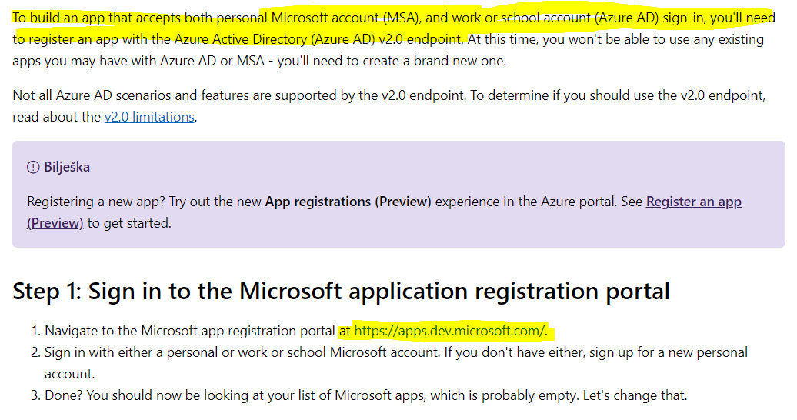
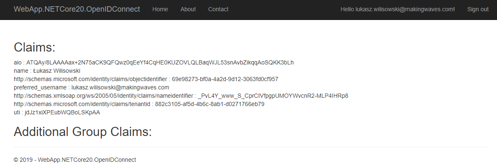
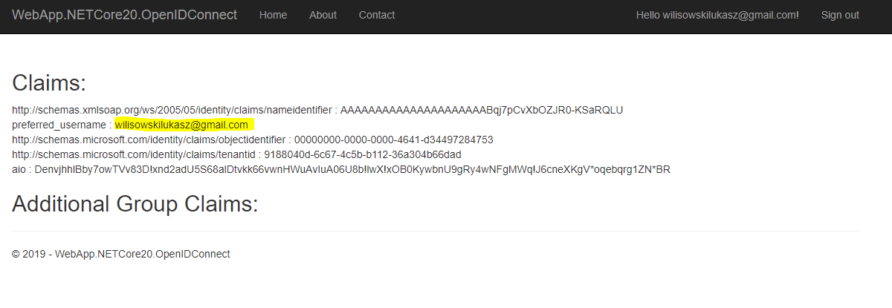
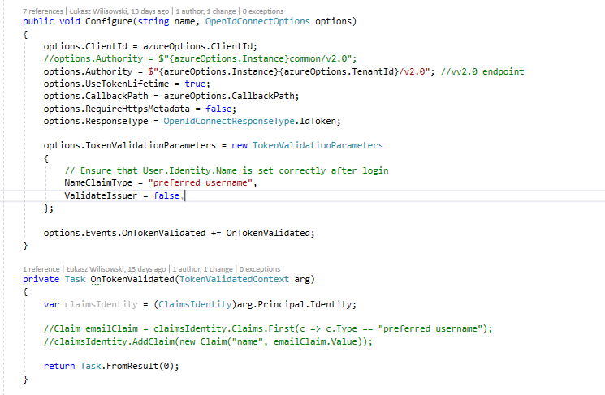

# Multi-tenant and Microsoft Account

Project: WebApp.NETCore20.OpenIDConnect, APS.NET Core 2.1

This implmentation requires 2.0 endpoint

You can log in with org account:

or MSA account

The configuration looks like this:

