# B2C application

Project: WebApp.NetCore.B2C, ASP.NET Core 2.1

With this app you will log in using personal social account.  

First create new B2C tenant: 

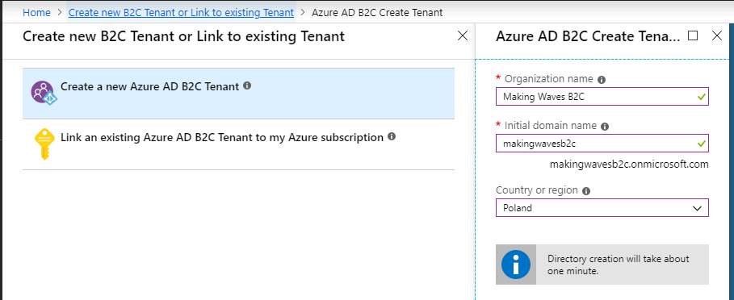

Then create B2C application: 

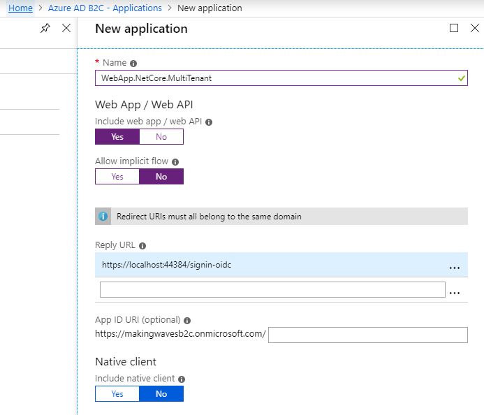

Add standard user flows: 

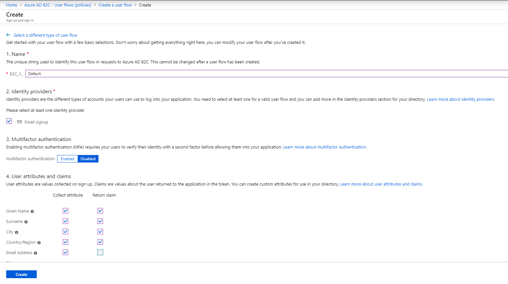

You can test the flow if you like or change the layout of your login page.  

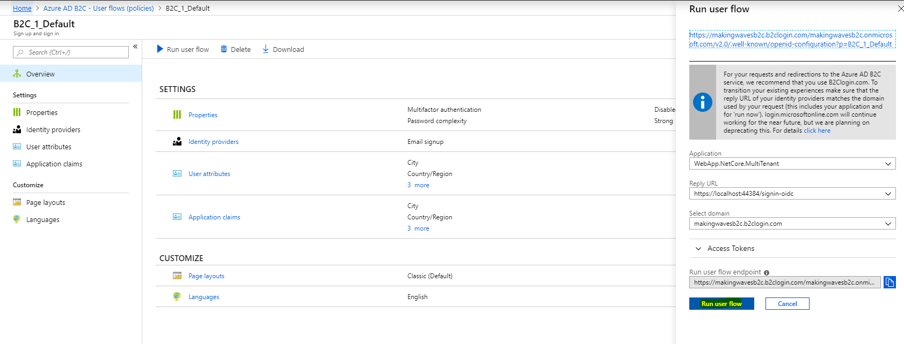

To log in with Google or MSA accounts we need to create proper applications of new Identity Providers. 
You can do this using Microsoft tutorials. 

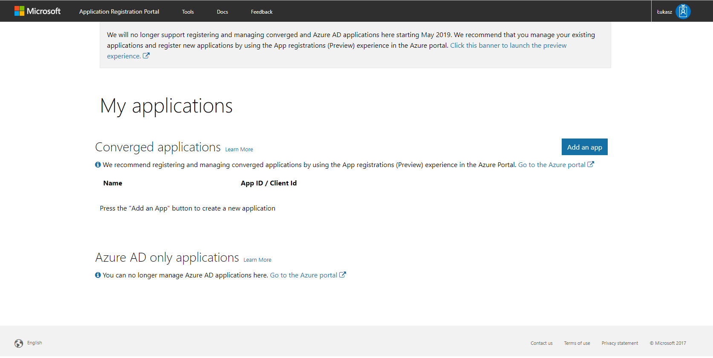

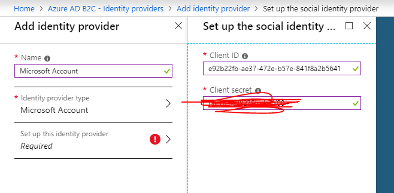

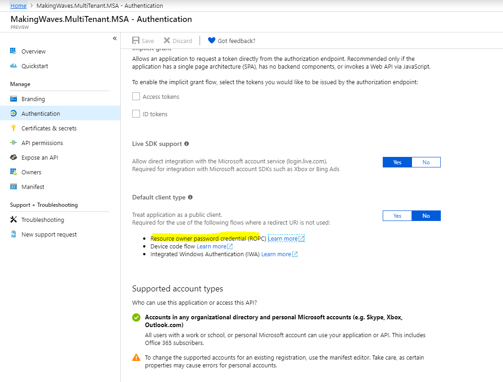

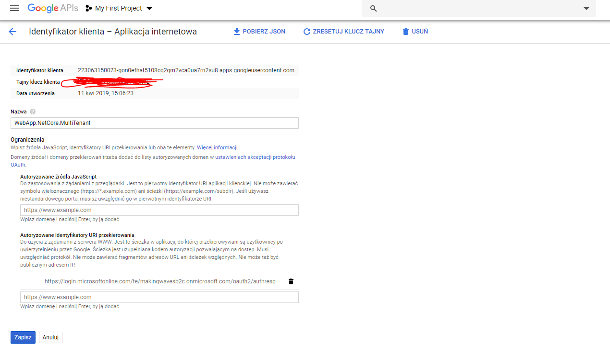

Finally you need to enable newly added IdPs into your user login flow. 

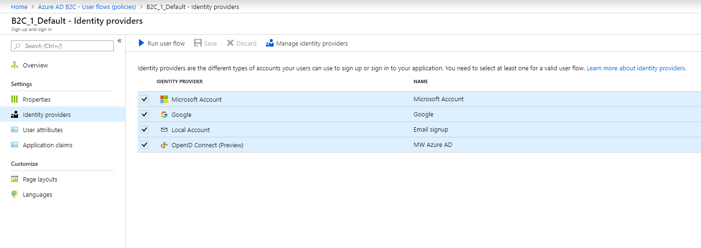

When user logs in with MSA account, he/she will see:

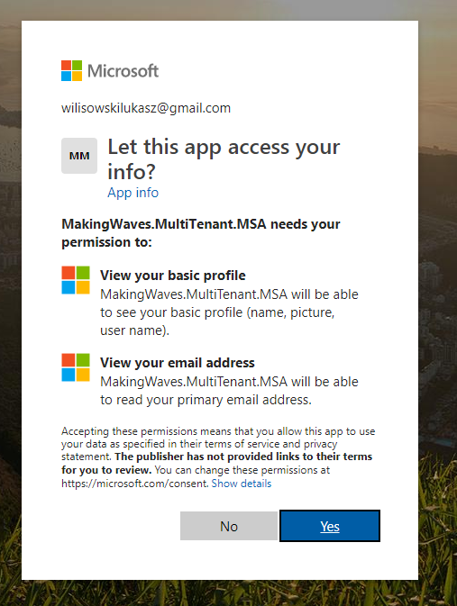

Now your app is ready to be tested: 

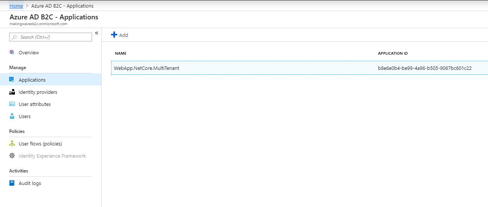

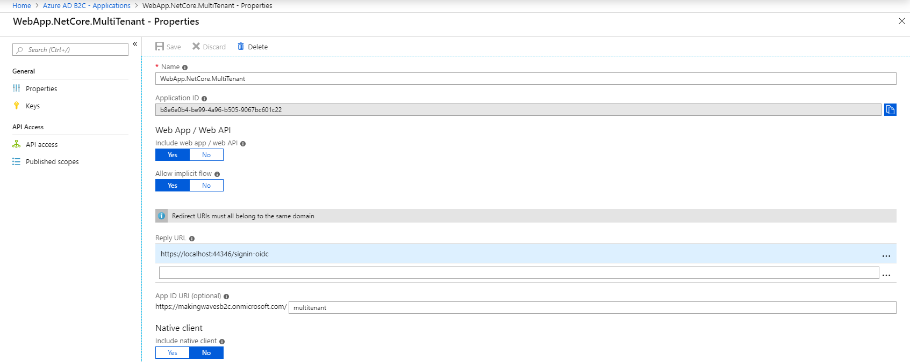

First create new account: 

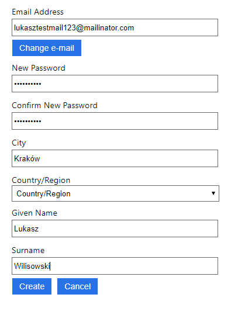

Application users: 

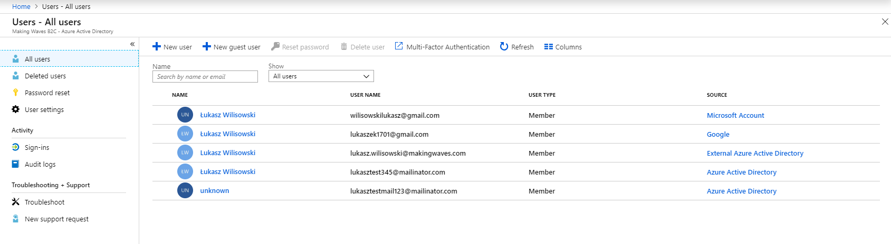
