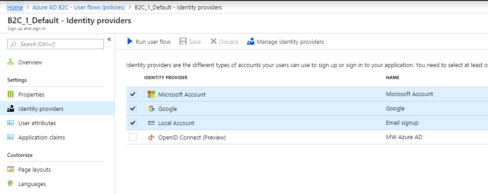

# B2B - B2C complete application

Project: WebApp.NetCore.FinalB2BB2C, ASP.NET Core 2.1

This application implements Dropbox-like authentication logic using Azure B2C service as auth. provider

If you choose personal login (application can discover it by the type of mail you enter), you will see following login page:

You can login using local application account, Google account or MSA account: 

If you choose to create new app account you will see registration form: 

You have also forgot password screen and profile edit screen:

The problem is when you log out, because Azure B2C does not support full single-sign-out. You need to implement it manually: 

If you enter organizational account, application will redirect you to separate Azure B2C login page: 

When there is only **one** IdP (Making Waves - Azure SAML 2.0 provider in this case) Azure B2C conveniently redirect you to IdP. Great :)

The following flows have been set up for this app: 

Additionally, custom sign in policies (Azure Saml 2.0) have been added. 
You can do it similarly with any organizational SSO set up by your B2B users. 

Full list of users: 

If you add phone based MFA you will see step like this:

For implementation details please check the source code. 

Thank you. 