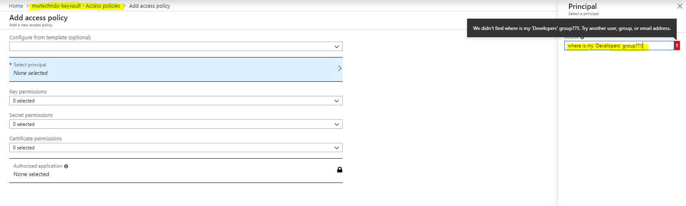
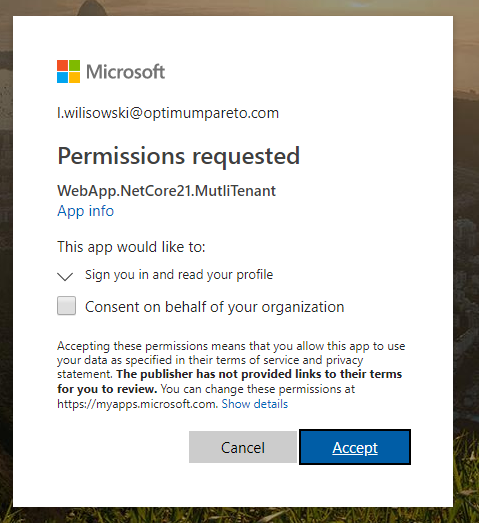
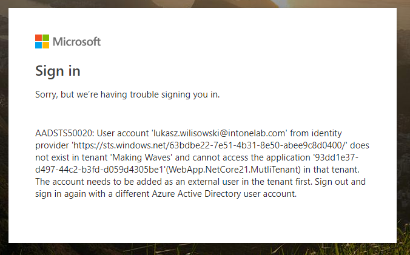

# Multi-tenant application

Project: WebApp.NetCore.MultiTenant, ASP.NET Core 2.1

In this example you can login to your Azure AD authenticated app using any Azure AD account. 

BTW: It would be nice to add Developers group to Azure AD :)

When you log in to this app you will see the consent screen: 

If you use login hint (redirecting to particular organization) you can also log in with guest account, but this B2B Guest must be added to directory first. 

