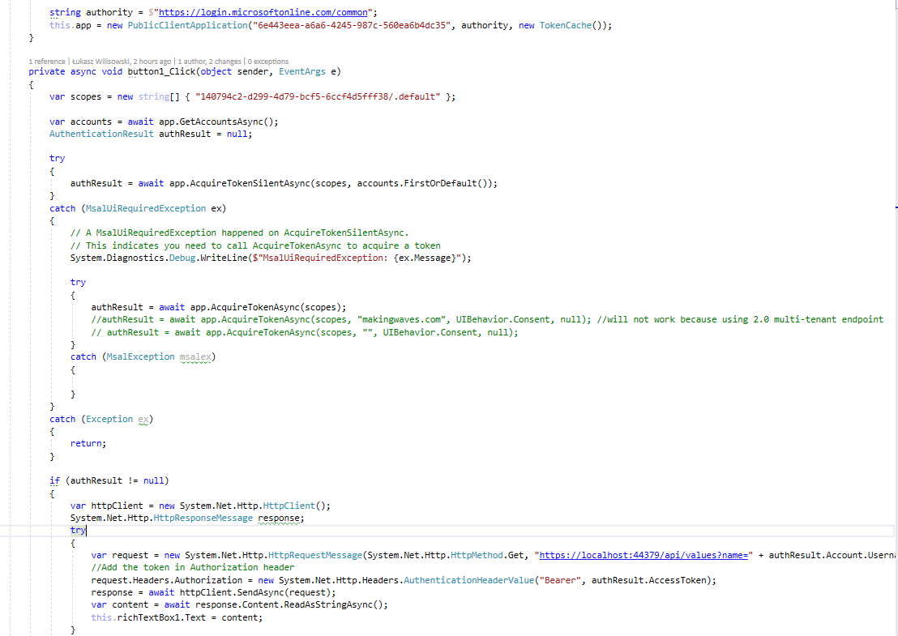
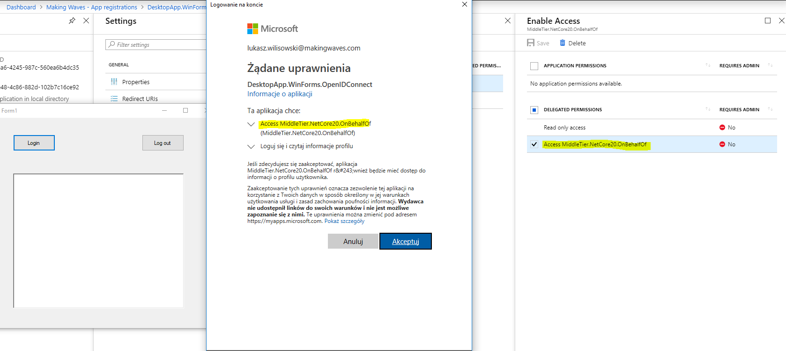
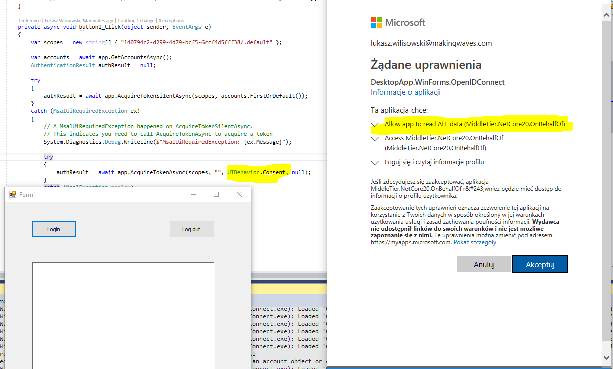
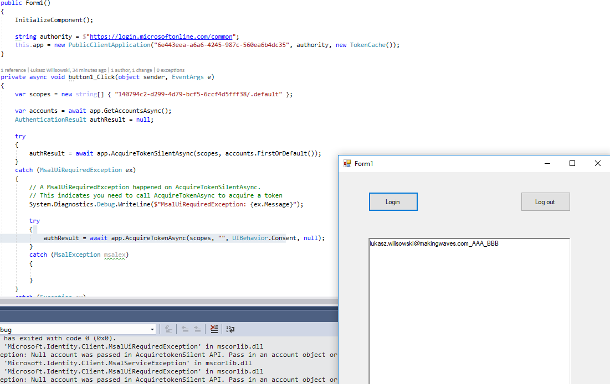
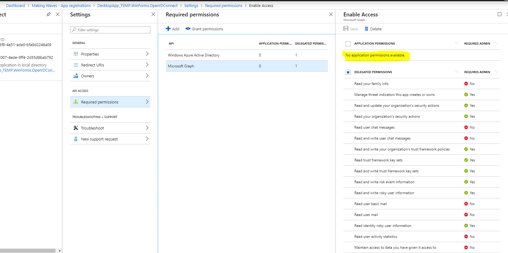
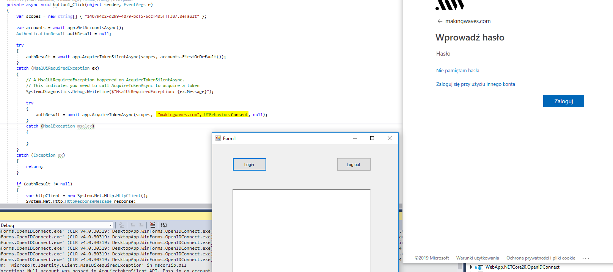
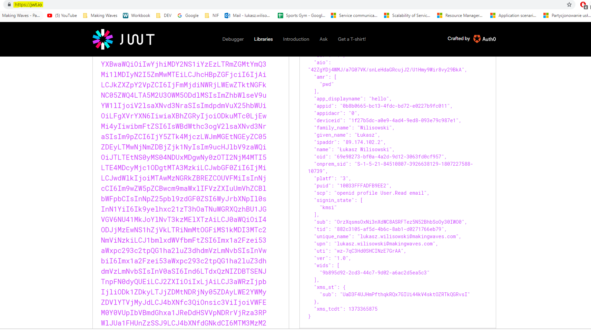
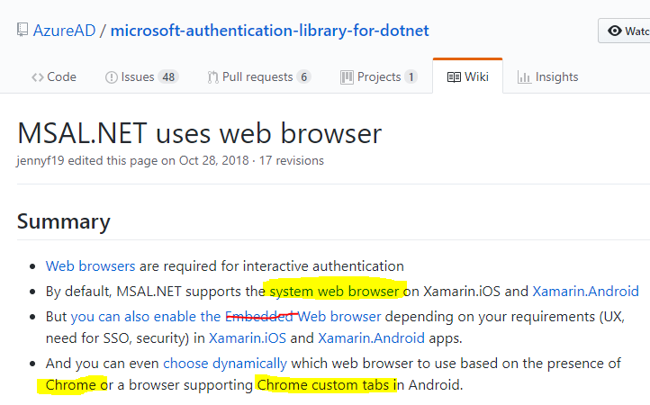

# Desktop Application

Project: DesktopApp.WinForms.OpenIDConnect
Library: MSAL 2.0


  
The only required code is this:  


  
If we add permissions to one API scope, this is what happens: 


  
The Web API requires second scope so we must add prompt=consent to get additional user consent.



As a result we see that API returned correct value.  
  
  

In this flow it is possible to impersonate other client, see below: 
  


That is why, the same as with SPA, application permissions are disabled. 
  
## Notes: 
1.	When requesting for SCOPE/.default permissions there are three options

```
Example 1: The user, or tenant admin, has granted permissions
The user (or a tenant administrator) has granted the client the Microsoft Graph permissions mail.read and user.read. If the client makes a request for scope=https://graph.microsoft.com/.default, then no consent prompt will be shown regardless of the contents of the client applications registered permissions for Microsoft Graph. A token would be returned containing the scopes mail.read and user.read.

Example 2: The user hasn't granted permissions between the client and the resource
No consent for the user exists between the client and Microsoft Graph. The client has registered for the user.read and contacts.read permissions, as well as the Azure Key Vault scope https://vault.azure.net/user_impersonation. When the client requests a token for scope=https://graph.microsoft.com/.default, the user will see a consent screen for the user.read, contacts.read, and the Key Vault user_impersonation scopes. The token returned will have just the user.read and contacts.read scopes in it.

Example 3: The user has consented and the client requests additional scopes
The user has already consented to mail.read for the client. The client has registered for the contacts.read scope in its registration. When the client makes a request for a token using scope=https://graph.microsoft.com/.default and requests consent through prompt=consent, then the user will see a consent screen for only and all the permissions registered by the application. contacts.read will be present in the consent screen, but mail.read will not. The token returned will be for Microsoft Graph and will contain mail.read and contacts.read.
```

2.    sadf


## Additionally: 

Domain hint can be used with 1.0 endpoint when you know you will ask for your organizational account. 

  

jwt.io website can help you decode and understand access tokens 

  

MSAL library should always open **systemic web-browser**, Microsoft is really not consistent here. 

  

Any programming **web view control** allows application owners to hook up to browsing methods and **spy on your passwords**. 