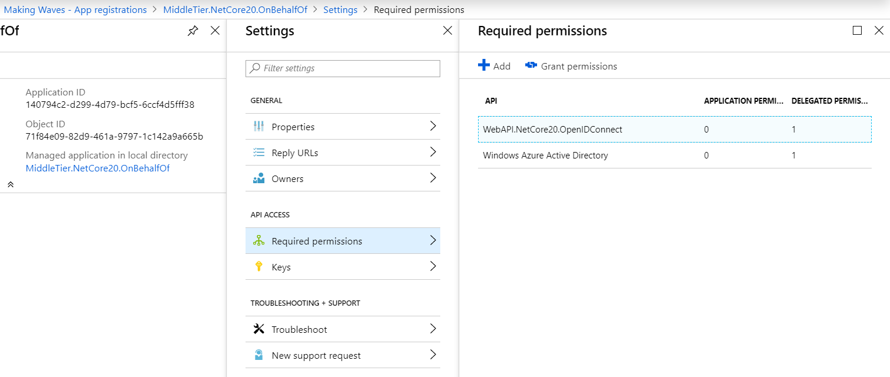
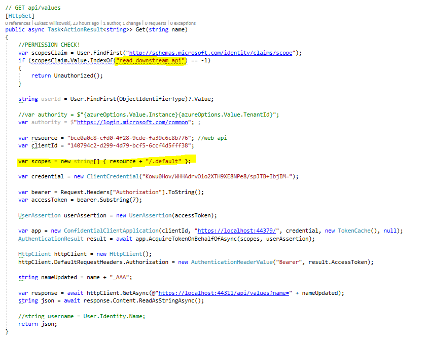

# Middle Tier API (Intermediate, central API)

Project: MvcSPA.NetCoreReact.OnBehalfClient

  
We have added additional permissions scope here. 

  
The important code is here

##Notes:
1.    You can ignore 'KnownClientApplications' in App's manifest
