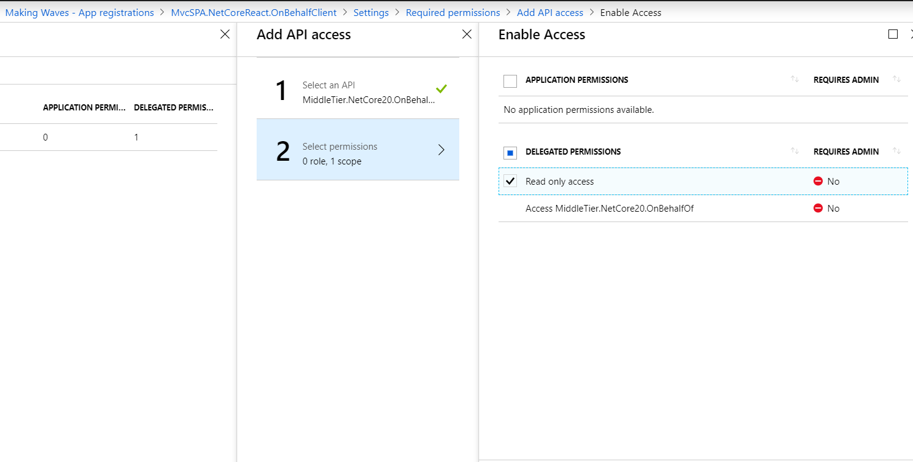
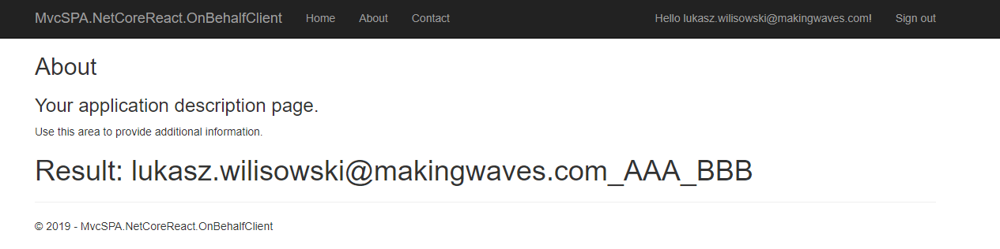
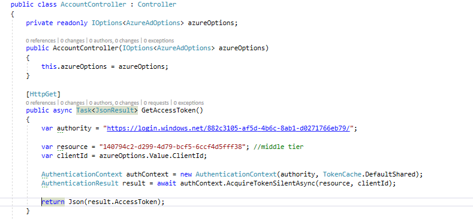
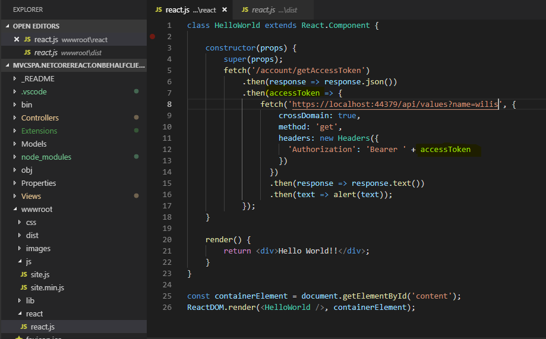
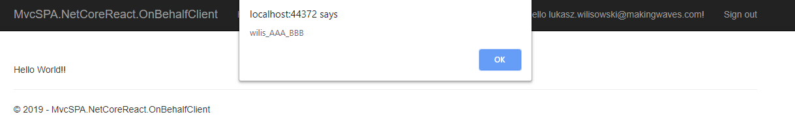

# MVC mixed with SPA application 

Project: MvcSPA.NetCoreReact.OnBehalfClient

  
Let's add some permissions first

  
The MVC Controller calls Middle Tier API which in turn calls the target Web API.  
Middle Tier API appends 'AAA' and target Web API appends 'BBB'

  
When MVC app is mixed with SPA, SPA **should not be using Implicif flow**  
Instead, SPA should get access token from MVC app through additional endpoint. 

SPA and React part:
  
  

After CORS is enabled in Middle Tier API we get successfull result:
  

