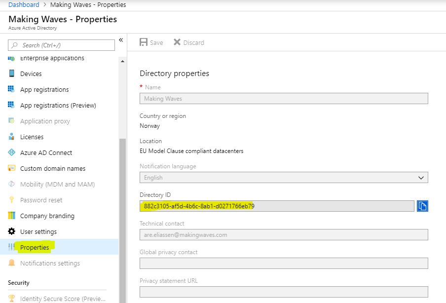

# Single-tenant scenarios

This repo contains many projects that use single-tenant authentication, that is signing up to one organization. 

Each project contains its own README file. 

## Authentication guidelines

1. Azure Active Directory (AAD): aad.portal.azure.com

2. To get your organization's Tenant ID, please go to AAD portal and copy id like here: 

