# OpenID Connect

Project: WebApp.DotNet46.OpenIDConnect, .NET 4.6

**OpenID Connect** supports few different authentication flows. The basic flow is Id_Token where you only recieve authenticated user info. 
In this project we will take a look at **Authorization Code Grant** flow, which returns access token needed to access Azure AD protected resource. 

More information about OIC can be found at: https://docs.microsoft.com/en-us/azure/active-directory/develop/v1-protocols-openid-connect-code

## Azure AD v1.0 and v2.0 authentication endpoints

The difference between old and new endpoint have been explained here: 
https://docs.microsoft.com/en-us/azure/active-directory/develop/azure-ad-endpoint-comparison

In this repository we are going to to check v1.0 endpoint. This endpoint is specifially pointing to Making Waves tenant. 

The generic metadata document can be found here: https://login.microsoftonline.com/{tenant}/.well-known/openid-configuration

In case of Making Waves it looks like below. I have highlighted important pieces. 

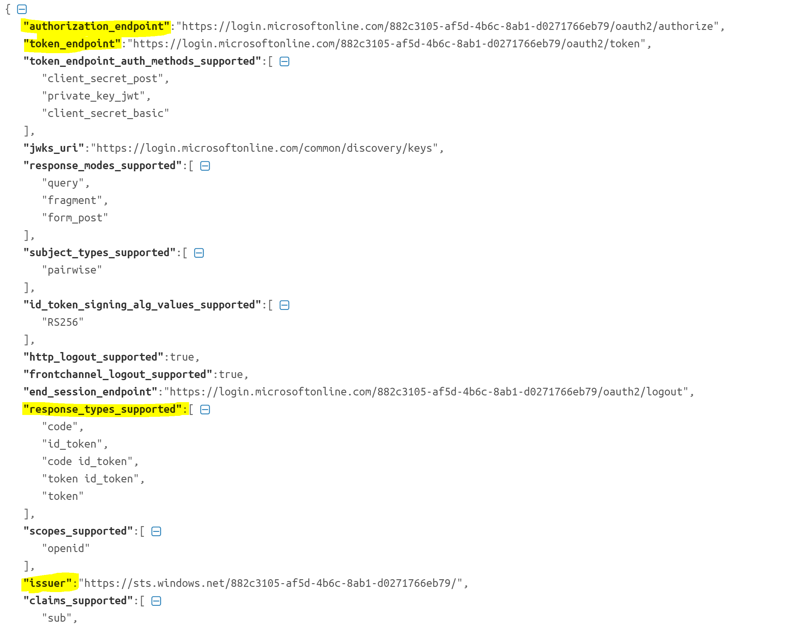

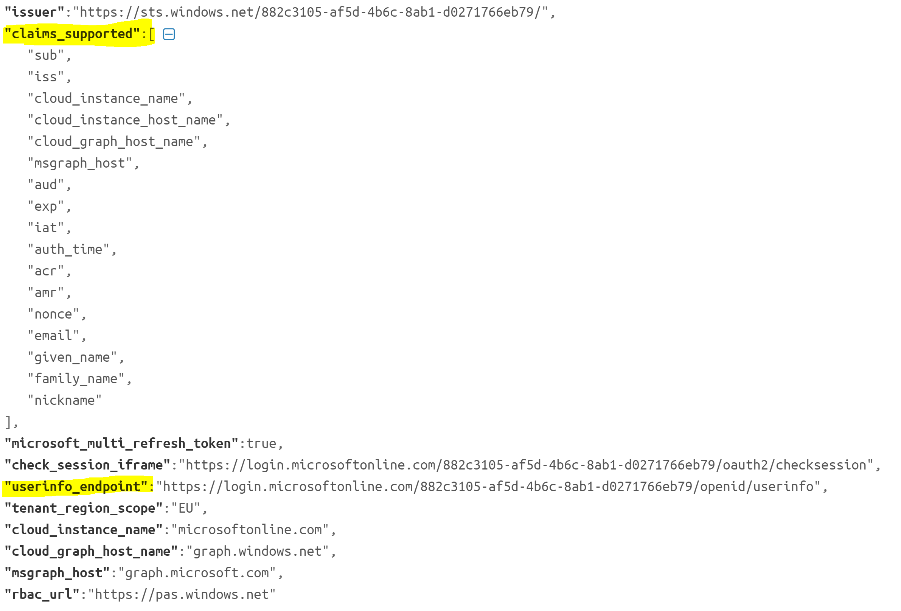

The authorization code grant flow works like this: 

## Visual Studio wizard

To register you OpenIDConnect application in Azure AD you can use Visual Studio wizard. 

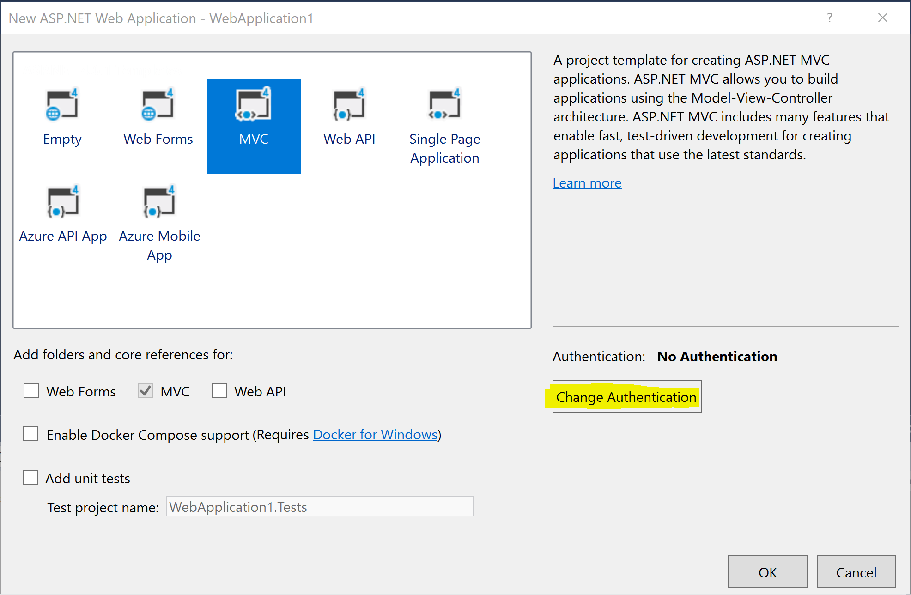

Please change authentication to Work and School accounts. 

The tenant id will be automatically filled based on your currently logged in Windows (browser) user. 

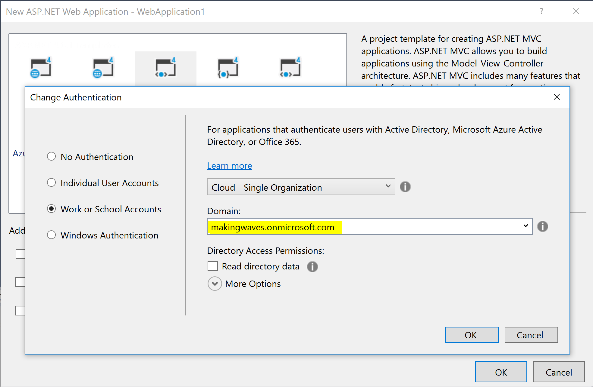

If you already have app registration in Azure AD then you can paste application id (client id) here: 

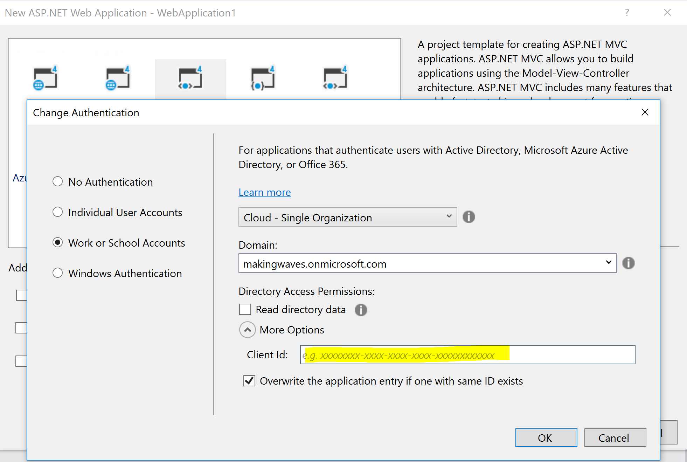

## Set up the app code in Visual Studio 

Setting up OpenIDConnect application with authorization code grant requires to add this intermediate step, 
where we exchange authorization code for access token to final resource. 

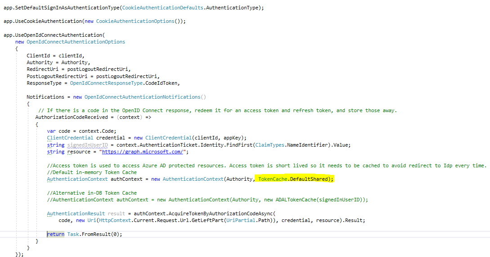

The example web.config looks like this. Please see an additional field client secret. 

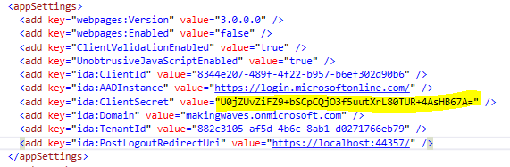

Client secret has been copied from Azure AD App registration: 

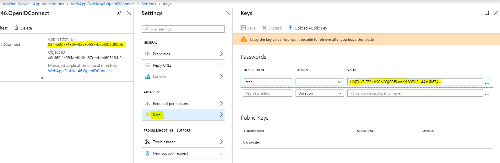

Application secret **should be securely stored in Azure Key Vault.**

## Access Token cache

Access token is used to access Azure AD protected resources. Access token is short lived so it needs to be cached to avoid redirect to IdP every time.

For more details please see: https://docs.microsoft.com/pl-pl/azure/active-directory/develop/access-tokens

There is **no** default, in-built implementation for this in ASP.NET

I tested two different strategies here: caching token **in memory - suitable for desktop and single-web-server** applicaitons. 

When you log in, you will see returned access and refresh tokens, saved into shared cache instance. 

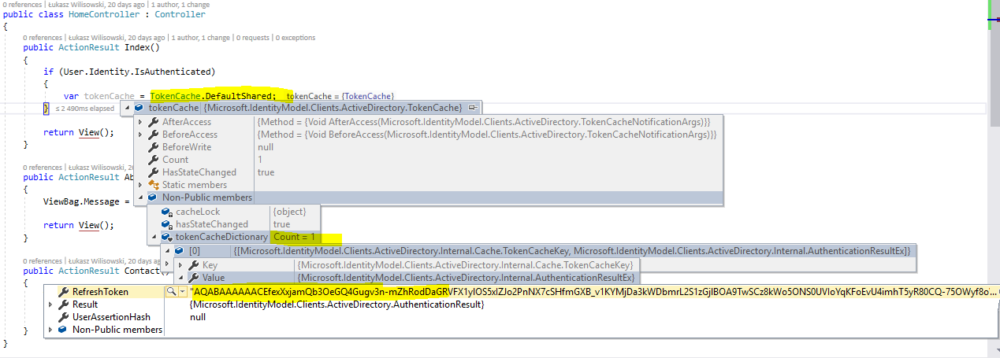

The second alternative is to use **DB to store tokens. This is useful for distributed web scenarios (web-farm)**. 

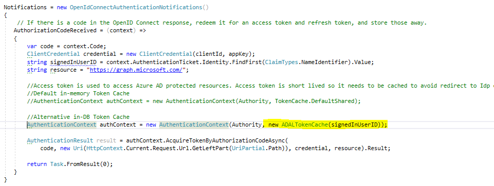

Double check: 

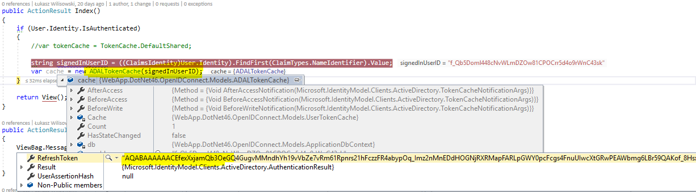

To summarize, few approaches are possible:

- get new access token with each request (time expensive and annoying for the end-user)
- use ADAL authentication library (only for native devices)
- keep the token in memory, invalidate it when expires and replace it using refresh token (good for single web-servers and development machines)
- keep the token in database or other distributed store (good for web-farms)
- if your refresh_token has also expired, you will need to go through the authorization process again.

To decode access tokens please use website like: https://www.jsonwebtoken.io/

To decode timestamps please use: https://www.epochconverter.com/

In our case we can see that both access token and refresh token have expiration time of 1 hour. 

The **expiration times of tokens are fully configurable**. 

Please see https://docs.microsoft.com/en-us/azure/active-directory/develop/active-directory-configurable-token-lifetimes for details. 

## Test

Before we test this application we will add new setting in application manifest in Azure AD. 

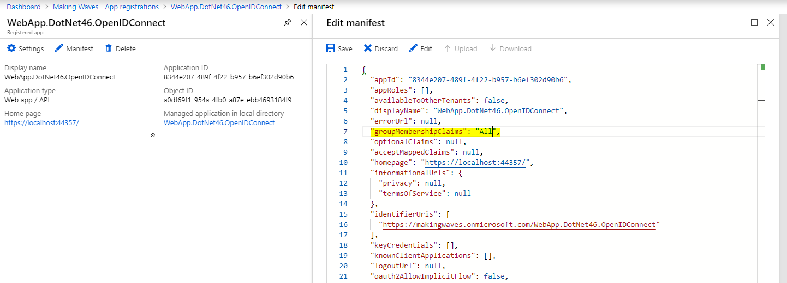

This will tell Azure AD to send in claims all groups that user is member of.  

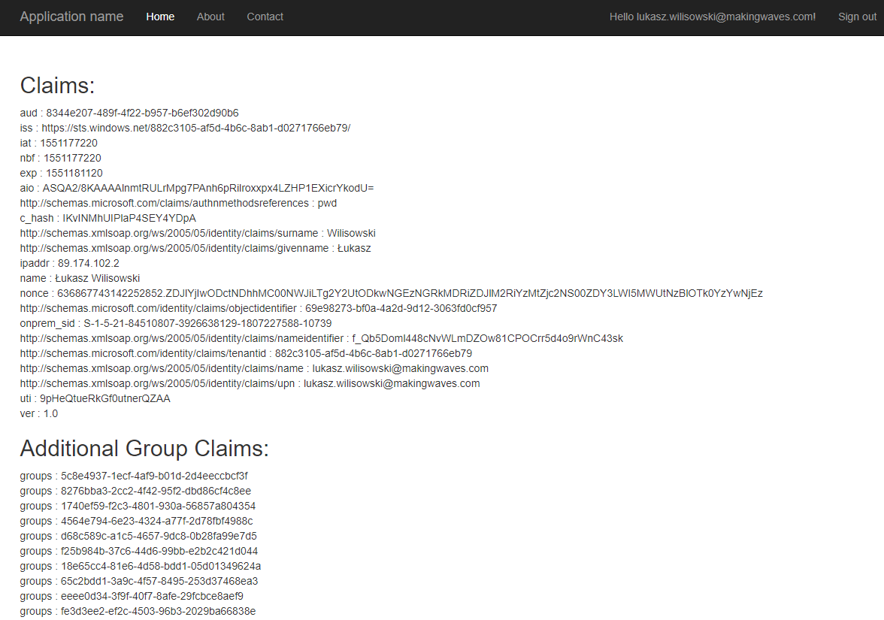

Those are the groups from Azure AD. 

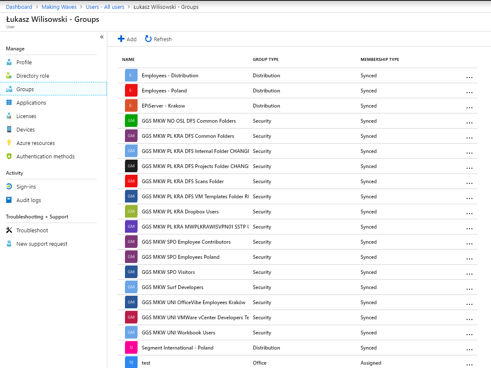

To find out group ID just click on a group in Azure AD 

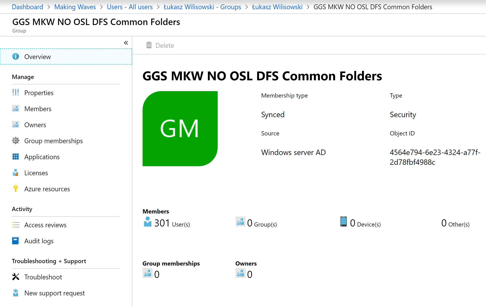.PNG)

The group IDs can be mapped in code to spefic application roles. 