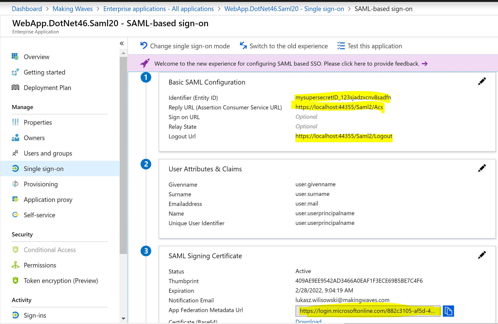
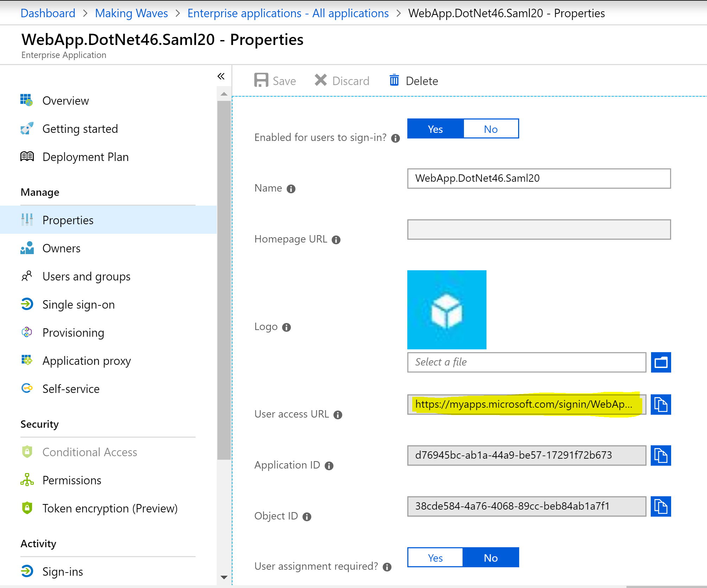
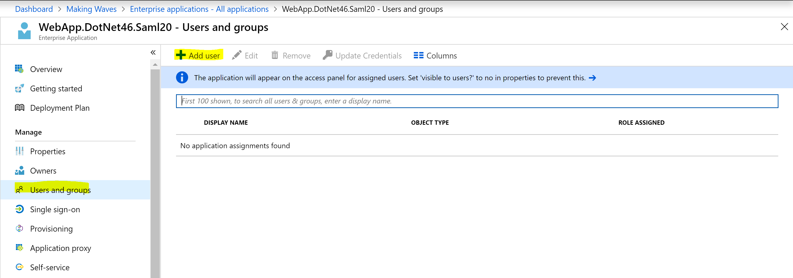
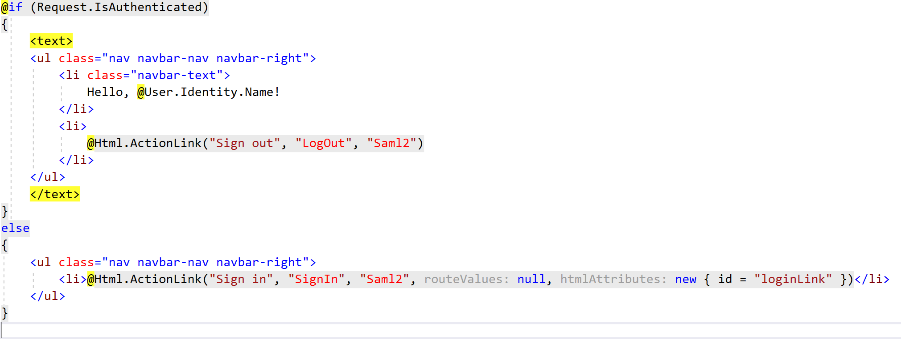
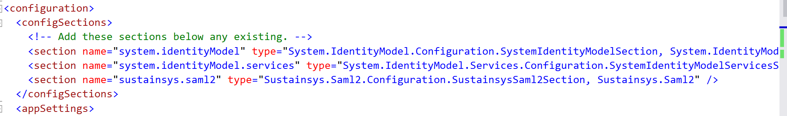
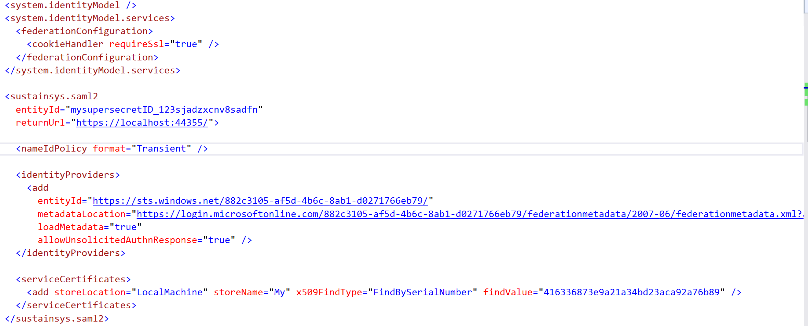
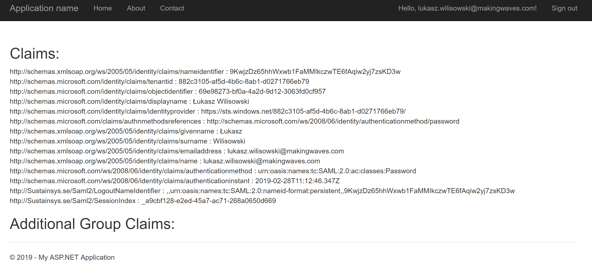

# SAML 2.0

Project: WebApp.DotNet46.Saml20, .NET 4.6

Official documentation: http://docs.oasis-open.org/security/saml/v2.0/saml-metadata-2.0-os.pdf

You cannot set up Saml 2.0 authentication with App Registration in AAD. 
Instead you need to enter **Non-gallery application** in Enterprise Applications panel. 

Application in this scenario is often called Service Provider (SP).

## New non-gallery application 

When adding new application enter a name for the application - that is all. 
After that you will see the page with application settings. 

To set up SAML authentication go to Single Sign On tab and enter application details:

- Entity id of your choosing, sometimes AAD complains about FQDN ids 
- Reply url will be the URL/**Saml2/Acs** 
- sign on url and relay state you can leave empty 
- fill logout url if you want to implement single-sign-out functionality
- there is an option to load application metadata instead of manually entering configurations but it does not work with Kentor's metadata file, So you should not count on it.

User attributes and claims you can configure later on. In most cases the default is enough. 

**SAML signing certificate** is used to sign messages from IdP (Azure AD) to your application. 
By default Azure AD uses a custom generated certificate but you can replace it with the one of your choosing (can be self-signed as well). 
App Federation Metadata Url will be useful when loading Azure configuration into your application. Please save the link for later. 

Azure SAML authentication does not support nor care about Sender Authenticity (signing messages from 
application to Idp with your own certificate), as there is no place here to enter this application certificate. 
You will need to use this certificate to implement single-sign-out functionality. 

In SAML 2.0 you can also encrypt tokens, but you should not use this legacy functionality because there are better ways to handle advanced scenarios now. 

Now let's take a look at App Properties. 

If you select user assignment required? -> to NO, then you will not have to assign users to start using your applications.

The one downside of this is that non-assigned users will not see the link to your application in their My Apps page.

It is always good to know which users have access to which applications. 
You can add assign users or groups to your app here: 

## Set up the app code in Visual Studio 

When loading SustainSys.Saml2.MVC NuGet package the library automatically addes an MVC controller to handle authentication requests. 

You can integrate it with your layout like here: 

To configure library you need to add custom sections in your web.config

And add Azure AD functionality based on the values copied from Azure AD. 

The service certificate added below is the SP-certificate that Azure does not really care about, but you need this to have Single-sign-out (which you should have)

## Test

Log in to your appliation using your organizational account. 

After logging to application, you will see the claims (user attributes):

When logging out you will see that Azure AD is trying to log you out from every logged SP. 

