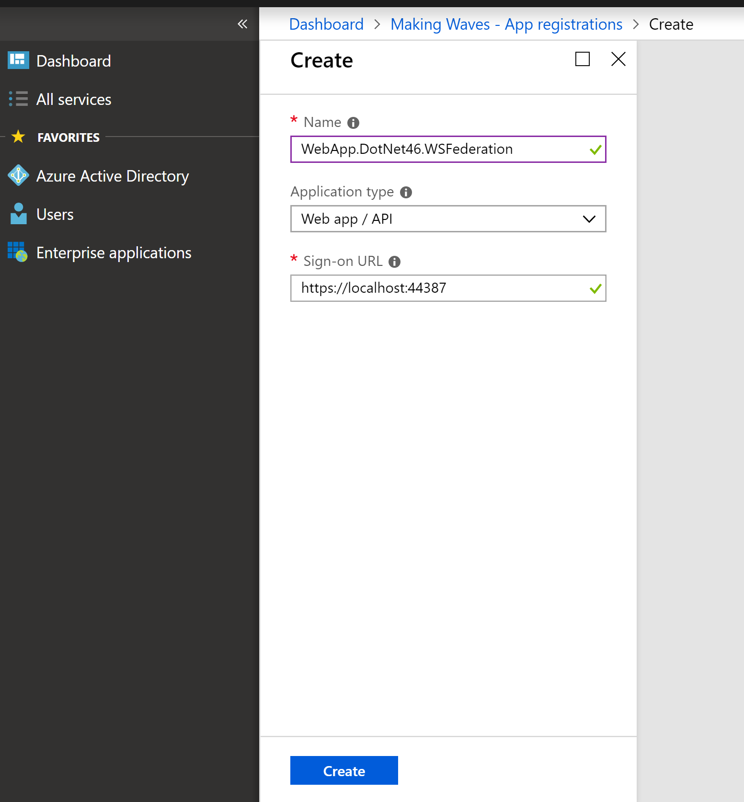

# WS-Federation 

Project: WebApp.DotNet46.WSFederation, .NET 4.6

To setup a **WS-Fed authentication**, one must first create App Registration in AAD

Official documentation: http://docs.oasis-open.org/wsfed/federation/v1.2/os/ws-federation-1.2-spec-os.html

Application in this scenario is often called Relaying Party (RP).

## App registration

Go to Azure Active Directory -> App Registration and create new registration. 

Now let's take a look at new app registration. The most important field is Application ID. 

Specify ReplyURLs for your application. This is the url that IdP (AAD) will use to POST SAML Response to your application (with user claims). 

Go to another tab: Azure Active Directory -> Enterprise Applications and configure sign in options to your application

You can manually assign users to your application (allow them to access your app) or enable open access like below. 

Finally, configure which permissions application will have in your directory. 

In our case, it is the base permission to access profile of user who logs into the application. 

## Set up the app code in Visual Studio 

Please take a look at this short OWIN configuration of WS-Federation middleware. 

You do not have to configure advanced AAD authenticaiton settings, the OWIN middleware will download everything dynamically using Metadata endpoint. 

The example web.config looks like this. Please see how we copied Tenant ID and Application ID from Azure AD. 

## Test

Log in to your appliation using your organizational account. 

You will see the consent form asking to allow app to read predefied user profile data. 

After logging to application, you will see the claims (user attributes):

