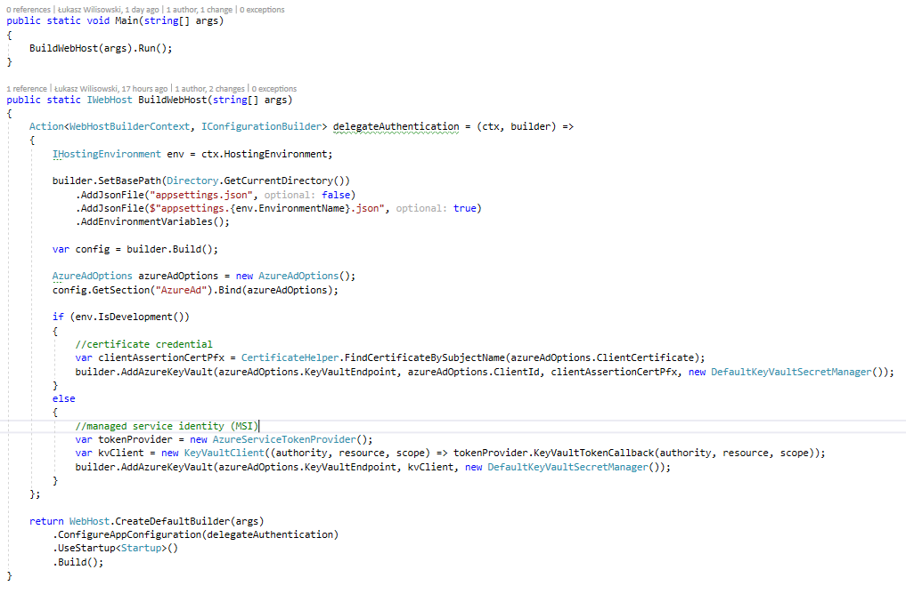

# OpenID Connect

Project: WebApp.NETCore20.GraphAPI, .NET Core 2.1

This project integrates with Microsoft applications using GraphAPI. 

## App registration

The registration is similar to previous examples. 

We have generated application keys and put them in our KeyVault.  

## Key Vault

You need to create Key Vault to store app secrets there. 

Add permission to:
- individual developer(s) OR
- developers group (Azure AD groups) -> BETTER
- Application (App registration) 
- Application in Azure (Managed Service Identity) -> BETTER

In our case we covered first two options. 

## Set up the app code in Visual Studio 

Getting secure configuration from KeyVault

The options are: 
- developer currently logged in to Visual Studio (KeyVaultTokenCallback)
- developers group (Azure AD groups) -> (KeyVaultTokenCallback)
- Application in Azure - MSI (KeyVaultTokenCallback)
- Application certificate (App registration) -> recommended when app is hosted outside Azure. Certificate must non-exportable, self-signed and uploaded to App Registration panel. 

Code Grant flow: 

To get access token to Microsoft Graph we must add permissions in App Registration

Please note that we have marked all user-delegated permissions (functional only in user context, when user is logged). 
We do not need application permissions (deamon application asking for user data outside of user logging session). 

Two of our delegated permissions required additional admin consent.
Those are group permissions, required to download a list of Microsoft Teams groups. 

**Permissions for your specific app should be selected based on your app requirements**  

## Graph API Authentication code

## Test

## Adding external users

If you want to allow external users to access your app you need to repeat steps below. 

