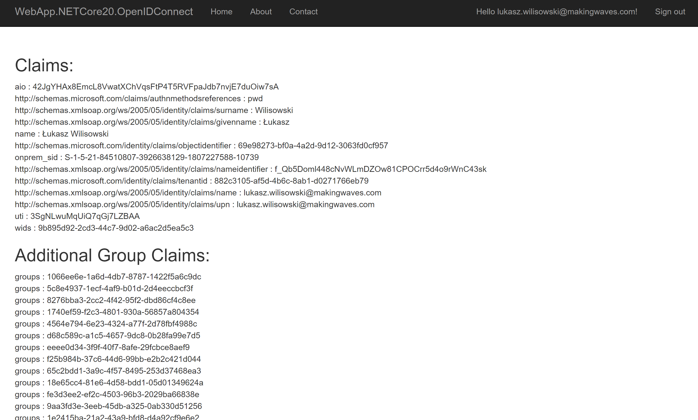

# OpenID Connect

Project: WebApp.NETCore20.OpenIDConnect, .NET Core 2.1

This is almost identical project to WebApp.DotNet46.OpenIDConnect with smaller authentication scope, that is application is requesting 
only id_token and no access_token. 

## App registration

To make it work we only had to add new reply url in app registration in Azure AD

## Set up the app code in Visual Studio 

The appliation setup is very easy here

## id_token

When logging, we can see in the fiddler that app is requesting id_token only (no access token). 
That is why we do not need authorization code exchange methods and no token cache. 

## Test

The application works like before.

