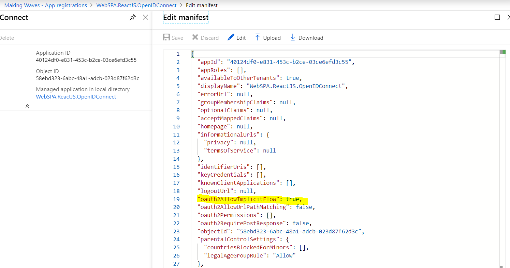
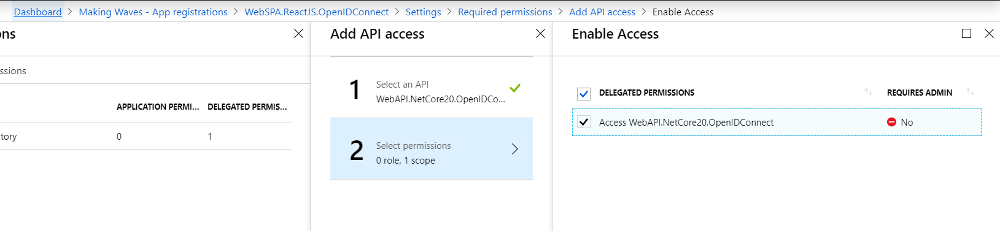
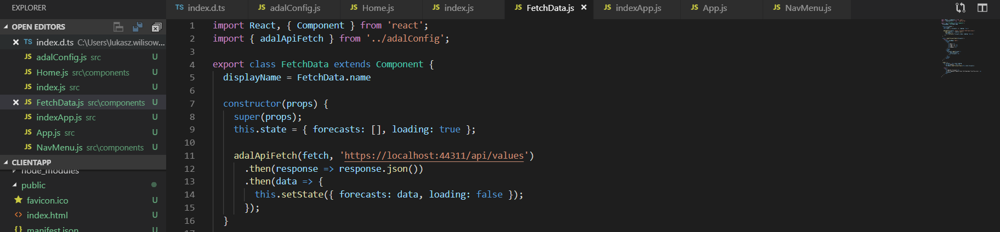
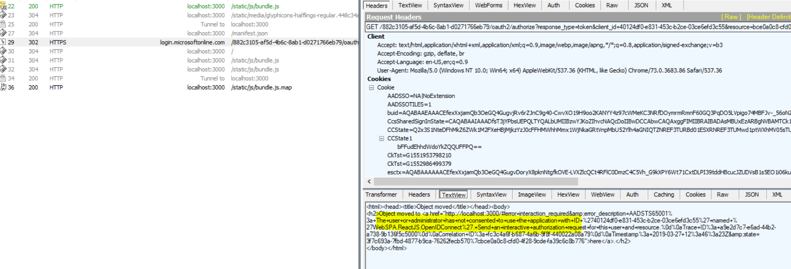
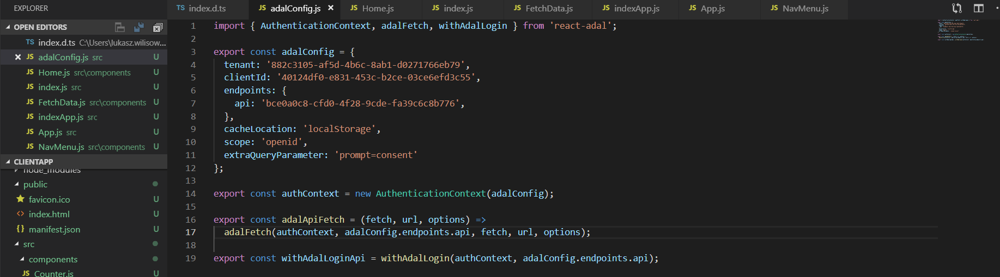
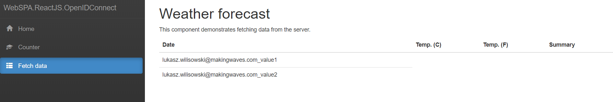

# Single-Page-Application

Project: WebSPA.NetCore20.OpenIDConnect

  
First we need to enable Implicit Flow

  
Add permission to access API. 

  
FetchData using CORS

User has not consented yet to access this API in delegated context
  

Enable one-time prompt, you need to disable later programically. 
  

Everything works as it should

  
## Notes: 
1.	Implicit flow and SPA client does not allow to have any app permissions. **Only user-delegated permissions** are allowed.
2.	In SPA mode we cannot authenticate client (web browser) - only user. Hence the code is not exchanged for access token. This is because traffic can be sniffed and access token is eventually returned 
in browser url. 
3.	Refresh token is not returned in this flow. Instead, each time the access token is needed, SPA app opens iframe and re-generates access token at IdP endpoint using current browser auth. session.
4.	CORS must be enabled in Web API